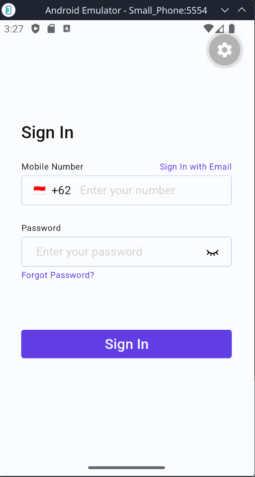
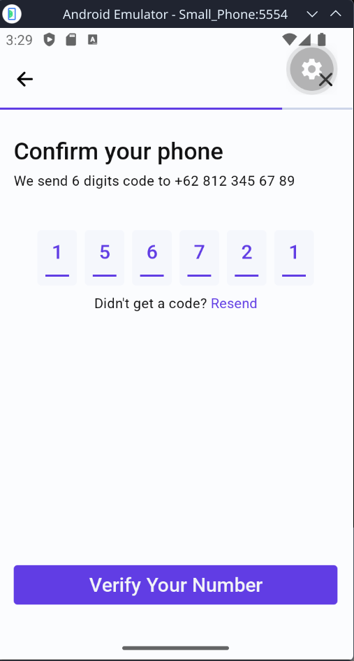
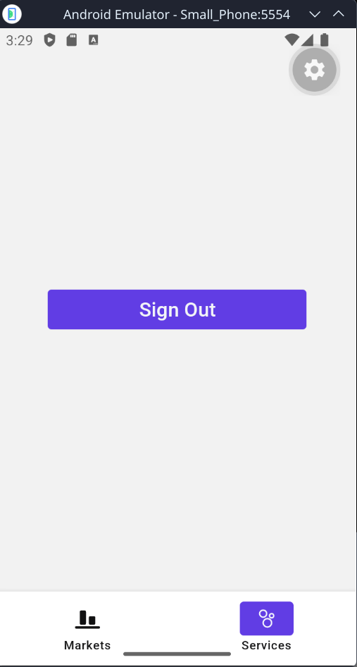

# Crypto Market

A React Native mobile application built with **Expo SDK 56** that provides cryptocurrency market data with a secure authentication flow.

[📥 Download APK (v1.0.0)](https://github.com/vstacked/crypto_market/releases/download/1.0.0/crypto-market-v1.0.0.apk)

---

## Project Overview

Crypto Market is a mobile-first application that offers:

- **Dynamic Login Screen** — supports both Email and Phone Number sign-in modes with a toggle, including a country-code selector modal for phone-based authentication.
- **OTP Verification Screen** — receives pre-filled route parameters (phone number & OTP) from the login flow and exposes a 6-digit `OtpInput` component with automatic focus management.
- **Market Screen** — displays a live list of cryptocurrency assets with local array filtering driven by category tabs (All / Favorites) and a debounced text search field, providing instant, lag-free UX without additional network requests.

### Screenshots

<p align="center">
  
  
  
  
</p>

### Tech Stack

| Layer          | Technology                                      |
| -------------- | ----------------------------------------------- |
| Framework      | React Native 0.85 + Expo SDK 56                 |
| Language       | TypeScript (strict mode)                        |
| State / API    | Redux Toolkit 2 + RTK Query                     |
| Navigation     | React Navigation 7 (Native Stack + Bottom Tabs) |
| Secure Storage | expo-secure-store                               |
| Testing        | Jest 29 + React Native Testing Library          |
| CI             | GitHub Actions                                  |

---

## Prerequisites

Ensure the following are installed on your machine before proceeding.

| Tool     | Minimum Version | Notes                             |
| -------- | --------------- | --------------------------------- |
| Node.js  | 18.x LTS        | 20.x LTS recommended              |
| npm      | 9.x             | Bundled with Node                 |
| Expo CLI | Latest          | Installed automatically via `npx` |

---

## Environment Setup

This project requires a `.env` file at the root to configure the API base URL. A template is already provided.

**1. Copy the example file:**

```bash
cp .env.example .env
```

**2. Open `.env` and fill in your value:**

```env
# .env
EXPO_PUBLIC_BASE_URL=https://your-api-base-url.com
```

> **Note:** All variables prefixed with `EXPO_PUBLIC_` are automatically inlined by the Expo bundler and are accessible via `process.env.EXPO_PUBLIC_BASE_URL` at runtime. Never store secrets in `EXPO_PUBLIC_` variables.

---

## Installation

Clone the repository and install dependencies:

```bash
git clone <repository-url>
cd crypto_market
npm install
```

---

## Running the App

### Option 1 — Expo Go (Physical Device)

> ⚠️ **Important — SDK 56 Compatibility Notice**
>
> This project uses **Expo SDK 56**. The Expo Go version available on the **Google Play Store** currently supports a **maximum of SDK 54** and is **not compatible** with this project.
>
> You must install the **latest Expo Go build directly from the Expo website**:
> **[https://expo.dev/go](https://expo.dev/go)**
>
> Download the version that matches SDK 56 from that page, install the `.apk` manually on your Android device, and then scan the QR code generated by `npx expo start`.

Start the Metro bundler:

```bash
npx expo start
```

Scan the QR code displayed in the terminal with the Expo Go app installed from the link above.

### Option 2 — Android Emulator

```bash
npm run android
```

Requires Android Studio with an AVD (Android Virtual Device) configured.

### Option 3 — iOS Simulator (macOS only)

```bash
npm run ios
```

Requires Xcode and the iOS Simulator.

---

## Running Tests

Execute the full Jest test suite in CI mode (no watch):

```bash
npm test
```

Generate a detailed HTML/text coverage report:

```bash
npm run test:coverage
```

The test suite covers:

- `MarketScreen` — rendering, category tab filtering (Favorites), and debounced search empty state.
- `OtpScreen` — pre-filled OTP input rendering and failed mutation `Alert` behaviour.
- `LoginScreen` — successful navigation to OTP screen, sign-in method toggle (Email ↔ Phone), and field-specific error display.

Additionally, custom hooks are thoroughly tested in isolation:
- `useLoginForm.test.ts` — handles method switching, validation, and authentication flows.
- `useMarketList.test.ts` — covers local array filtering, search debouncing, and API states.
- `useOtpVerify.test.ts` — validates OTP verification logic, mutation states, and navigation.

---

## Project Structure

```
crypto_market/
├── src/
│   ├── __tests__/          # Jest test suites
│   ├── assets/             # Static assets (images, icons)
│   ├── components/         # Reusable UI components (OtpInput, etc.)
│   ├── constants/          # Design tokens and theme
│   ├── hooks/              # Custom hooks (useLoginForm, useOtpVerify, useMarketList)
│   ├── navigation/         # AppNavigator, typed param lists
│   ├── screens/            # LoginScreen, OtpScreen, MarketScreen, ServicesScreen
│   ├── services/           # RTK Query API slice definitions
│   ├── store/              # Redux store, auth slice
│   ├── types/              # Shared TypeScript interfaces
│   └── utils/              # secureStorage helpers
├── .env.example            # Environment variable template
├── app.json                # Expo app configuration
├── babel.config.js
├── jest.config.js
├── tsconfig.json
└── package.json
```

---

## Architectural Decisions

- **Logic-less Screens:** I kept the UI components as "dumb" as possible. All the complex state, API calls, and business logic live in custom hooks (like `useLoginForm` and `useMarketList`). It makes the actual screen files way easier to read and test.
- **Grouped Hook Returns:** Instead of returning massive, flat lists of variables from my custom hooks, I grouped the return values by domain (e.g., `auth.handleLogin`, `form.identifier`). It keeps the destructuring clean and self-documenting.
- **React Navigation v7 Static API:** I opted for the Static API. By using the `if` guards for routing based on my Redux auth selectors (`useIsLoggedIn`, `useIsGuest`), I completely avoided having to manually call `navigation.replace` or `navigation.reset` across the app.
- **Transient OTP State:** I stored the OTP code returned by the login API temporarily in Redux. Once the user successfully verifies it on the next screen, I clear it. It was the cleanest way to handle cross-screen state without passing sensitive data through route parameters.
- **Discriminated Unions for Login:** For the login payload, I used a discriminated union in TypeScript rather than making `email` and `phone` optional fields. This forces the compiler to ensure exactly one identifier is passed, making invalid states unrepresentable.
- **Mutation-based Logout:** I handled the logout action using an RTK Query `queryFn`. Even though it just deletes a local token without hitting the network, keeping it as a mutation allowed me to easily use standard `isLoading`/`isError` UI states.
- **Deferred Token Persistence:** Security-wise, I made sure the `expo-secure-store` token is _only_ saved after the OTP is successfully verified, rather than at the initial login step. Between those steps, the token is strictly held in memory during runtime. This keeps the credential safe and ensures the app never persists a partially authenticated state to the device.
